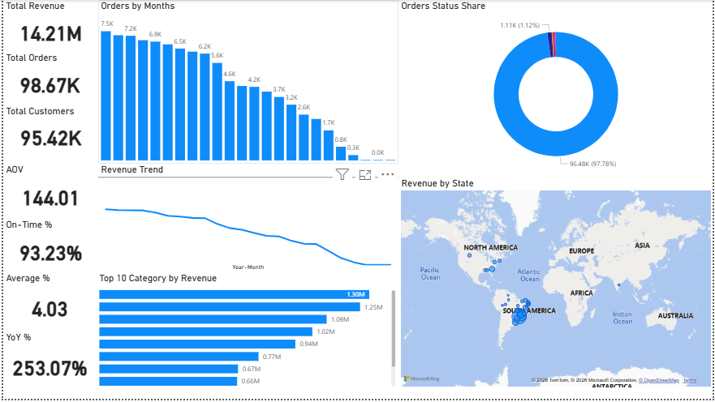
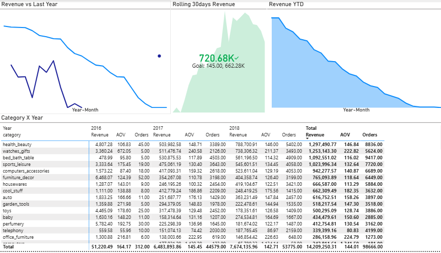

# 📊 Olist E-commerce Data Analytics Project (PostgreSQL + Power BI)

## 🚀 Overview
This project demonstrates a complete **end-to-end data analytics workflow** using the Olist e-commerce dataset. It includes data ingestion, validation, transformation, optimization, and interactive dashboard creation using **PostgreSQL** and **Power BI (DirectQuery mode)**.

---
## 🖼️ Dashboard Preview

<p align="center">
  
  
</p>

<p align="center">
  
  
</p>

## 🛠️ Tech Stack


## 📁 Dataset
- Source: Kaggle (Olist E-commerce Dataset)
- Format: CSV (multiple files)
- Includes:
  - orders
  - order_items
  - customers
  - products
  - sellers
  - payments
  - reviews
  - category_translation

---

## ⚙️ Project Workflow

### 1. Data Collection
- Download dataset from Kaggle
- Extract ZIP file
- Store CSV files locally

---

### 2. Database Setup

```sql
CREATE DATABASE olist_db;
3. Create Raw Tables

Example
CREATE TABLE orders (
    order_id TEXT PRIMARY KEY,
    customer_id TEXT,
    order_status TEXT,
    order_purchase_timestamp TIMESTAMP,
    order_approved_at TIMESTAMP,
    order_delivered_carrier_date TIMESTAMP,
    order_delivered_customer_date TIMESTAMP,
    order_estimated_delivery_date TIMESTAMP
);
Step 4: Load Data
COPY orders FROM '/path/orders.csv'
DELIMITER ',' CSV HEADER;

use pgAdmin Import Tool
Step 5: Data Validation ✅

-- Row Count
SELECT COUNT(*) FROM orders;

-- Null Check
SELECT COUNT(*) FROM orders WHERE order_id IS NULL;

-- Duplicate Check
SELECT order_id, COUNT(*)
FROM orders
GROUP BY order_id
HAVING COUNT(*) > 1;

Step 6: Indexing ⚡
CREATE INDEX idx_orders_customer_id ON orders(customer_id);
CREATE INDEX idx_orders_purchase_ts ON orders(order_purchase_timestamp);
CREATE INDEX idx_order_items_order_id ON order_items(order_id);
CREATE INDEX idx_products_product_id ON products(product_id);
Step 7: BI Layer (Views)
CREATE VIEW bi_fact_sales AS
SELECT 
    o.order_id,
    o.customer_id,
    oi.product_id,
    oi.seller_id,
    o.order_purchase_timestamp::date AS purchase_date,
    oi.price,
    oi.freight_value,
    (oi.price + oi.freight_value) AS total_amount
FROM orders o
JOIN order_items oi ON o.order_id = oi.order_id;

Step 8: Validate BI Views

SELECT order_id, COUNT(*)
FROM bi_fact_sales
GROUP BY order_id
HAVING COUNT(*) > 1;

SELECT SUM(total_amount) FROM bi_fact_sales;

Step 9: Power BI Integration
Open Power BI Desktop
Get Data → PostgreSQL
Select DirectQuery mode

Step 10: Load Data
Load only:
bi_fact_sales
Dimension tables (optional)

Step 11: Date Table

Create DimDate (Import mode)
DimDate[Date] → bi_fact_sales[purchase_date]
Step 12: Data Modeling
Customers → Sales
Products → Sales
Sellers → Sales
Storage Mode → DirectQuery
Step 13: DAX Measures 📐

Step 14: Dashboard Pages 📊
Overview Dashboard
Sales Analysis
Product Insights
Customer Behavior
Logistics & Delivery
Reviews & Ratings
Payments Analysis
Seller Performance
🔹 Step 15: Performance Optimization ⚡
Avoid heavy visuals
Reduce cross-filtering
Limit high-cardinality columns
Use aggregations
Monitor with Performance Analyzer